本研究針對 `vendor_kit` 的升級（upgrade）流程設計，基於「主機僅有 Docker + git + just」、「工具 dist 從 GHCR 容器鏡像抽出」、「工具不自動改使用者檔案，只顯示 diff」等限制與原則，查證真實前例與官方實踐，依 1 至 5 分節提供完整研究與建議。

---

### 1. Renovate 自動化更新前例（對應路徑 A 技術基礎）

在專案相依性管理中，針對非標準套件格式（如專案自訂的 `.version` TOML 檔），業界多採用 Renovate 的自訂管理器（Custom Manager）搭配 Docker 資料來源來完成自動化追蹤。

1. **自訂 Manager 匹配與資料來源對接**：
   Renovate 原 `regexManagers` 已統整為 `customManagers`，支援使用正規表達式從任意文字檔中提取套件資訊。透過設定 `customType: "regex"`、`fileMatch: ["^\\.version$"]` 並將 `datasourceTemplate` 指定為 `docker`，Renovate 會自動使用其內建的 OCI/Docker Registry 用戶端連線至 GHCR 查詢版本更新（[Renovate Regex Manager 文件](https://docs.renovatebot.com/modules/manager/regex/)、[Renovate Docker Datasource 文件](https://docs.renovatebot.com/modules/datasource/docker/)）。

2. **Digest 鎖定與不可變置換（Pinning & Auto-replace）**：
   針對 `<name> = "ghcr.io/…:tag@sha256:…"` 這類同時帶有 Tag 與 Digest 的不可變參照，Renovate 提供了 `pinDigests: true` 設定選項。搭配 `autoReplaceStringTemplate` 模板（如 `{{depName}}:{{newValue}}@{{newDigest}}`），Renovate 在檢測到新版本 Tag 發布時，會主動向 Registry 解析出該 Tag 對應的 Manifest Digest，並於開啟 PR 時一次改寫 Tag 與 Digest 兩處，確保建置的重現性與防竄改（[Renovate Pin Digests 設定](https://docs.renovatebot.com/configuration-options/#pindigests)、[Renovate 自訂置換模板文件](https://docs.renovatebot.com/modules/manager/regex/#autoreplacestringtemplate)）。

3. **CI 煙霧測試與程式碼漂移處理（Drift Check & Auto-commit）**：
   Renovate PR 預設僅修改 `.version` 文字行。業界標準實踐是由 CI（如 GitHub Actions）在 PR 觸發時執行 `just`（如 `just test` 或 `just --dry-run`）以驗證從新鏡像抽出之工具能否正常運行。若升級包含啟動器自身（`vendor_kit`），會使 Git 追蹤的 `.vendor_kit/` recipe 產生漂移，CI 可透過執行驗證並檢查 `git diff --exit-code` 阻擋未同步的 PR，或藉由 GitHub Actions（如 `stefanzweifel/git-auto-commit-action`）將啟動器產出的更新 commit 回該 PR 分支（[git-auto-commit-action 專案庫](https://github.com/stefanzweifel/git-auto-commit-action)）。

---

### 2. 受限主機環境查詢 Registry 前例（對應路徑 B 技術基礎）

主機環境限制「僅安裝 Docker + git + just」，未安裝 `curl`、`jq`、`crane` 或 `skopeo` 等 CLI 工具，此時查詢遠端 Registry 的最新 Tag 與 Digest 面臨以下技術邊界與前例：

1. **原生 Docker CLI 的限制（缺少 Remote Tag Listing）**：
   經查證，原生 `docker` CLI（包括 `docker images` 與 `docker search`）**沒有**提供列出遠端 Registry 所有可用 Tag 的指令（[Docker CLI 官方指令參考](https://docs.docker.com/reference/cli/docker/)）。雖然現代 Docker 內建的 `docker buildx imagetools inspect <image>:<tag>` 能夠在不 pull 完整 image layers 的情況下查詢指定 Tag 的 Manifest Digest（[Docker buildx imagetools inspect 官方文件](https://docs.docker.com/reference/cli/docker/buildx/imagetools/inspect/)），但其前提是「必須預先知道目標 Tag 名稱」，無法解決「探索最新版本（latest/semver）」的需求。

2. **暫態容器（Ephemeral Container）執行專用工具：最優前例**：
   既然本機已有 Docker daemon，最輕量且標準的做法是利用「暫態容器（`docker run --rm`）」執行專為 OCI Registry 設計的單一二進位工具：
   - **Google `crane`**：官方提供容器映像檔 `gcr.io/go-containerregistry/crane`，大小僅數 MB。執行 `docker run --rm gcr.io/go-containerregistry/crane ls ghcr.io/<org>/<name>` 可列出所有 tags；執行 `docker run --rm gcr.io/go-containerregistry/crane digest ghcr.io/<org>/<name>:<tag>` 可直接取得 SHA256 digest（[GoogleContainerTools crane 專案庫](https://github.com/google/go-containerregistry/tree/main/cmd/crane)）。
   - **Red Hat `skopeo`**：官方鏡像 `quay.io/skopeo/stable`，支援 `skopeo list-tags docker://ghcr.io/...` 與 `skopeo inspect`，但啟動與鏡像體積略大於 crane（[Containers skopeo 專案庫](https://github.com/containers/skopeo)）。
   - **自建 vendor_kit 輔助容器**：由 `vendor_kit` 自身的映像檔內建 tag/digest 查詢腳本，直接 `docker run --rm ghcr.io/<org>/vendor_kit check-update <name>`。

3. **GHCR API 與認證處理**：
   GHCR 遵循 OCI Distribution Specification。即使是公開套件，查詢 `/v2/<name>/tags/list` 亦須遵循 401 挑戰協定，先向 `https://ghcr.io/token?service=ghcr.io&scope=repository:<name>:pull` 換取匿名 Bearer Token 才能取得清單（[OCI Distribution Spec 標籤列舉規範](https://github.com/opencontainers/distribution-spec/blob/main/spec.md#listing-tags)）。`crane` 與 `skopeo` 已原生內建此匿名換證流程，若使用 curl 自行實作需多一步換證處理。

4. **CLI 設計哲學：修改檔案 vs 僅顯示 diff**：
   - 業界工具如 `mise` 提供了 `mise upgrade --dry-run` 僅印出預計變更而不改動檔案（[mise upgrade 官方手冊](https://mise.jdx.dev/cli/upgrade.html)）；`terraform plan` 僅計算並顯示 diff 而不套用變更（[Terraform Plan 官方文件](https://developer.hashicorp.com/terraform/cli/commands/plan)）。
   - `aqua update` 則是主動改寫配置檔並搭配 diff 輸出供檢閱（[aqua update 官方文件](https://aquaproj.github.io/docs/reference/update/)）。
   - 符合 vendor_kit「不自動改使用者檔案，只顯示 diff」的最佳前例：`just upgrade <name>` 在有指定 `--dry-run`（或預設）時僅計算並印出 `.version` 的 diff 與 release notes；確認升級時**僅修改 `.version` 單一檔案並輸出 git diff**，而「不安裝工具實體」，將實體抽取推遲至使用者下次執行 `just`（惰性安裝）。

---

### 3. vendor_kit 自身升級與 Recipe Bootstrap 前例（對應路徑 C 技術基礎）

啟動器自身（`vendor_kit`）升級時，面臨「`.vendor_kit/` recipe 進 git」與「舊 recipe 如何安全替換為新 recipe」的自舉難題。

1. **升級順序性：先啟動器後工具**：
   啟動器定義了工具抽取的規格、快取路徑與掛載邏輯。若新版工具的打包格式或旗標變更，使用舊版啟動器 recipe 抽取新工具可能導致未預期的崩潰。因此必須「先升級啟動器 recipe，再升級被管理的工具」（前例：Gradle Wrapper 升級時，先執行 wrapper 任務更新 `gradlew` 與屬性檔，再執行新版構建；[Gradle Wrapper 升級手冊](https://docs.gradle.org/current/userguide/gradle_wrapper.html#sec:upgrading_wrapper)）。

2. **Just 直譯器解析特性與行程替換（Process Replacement）**：
   - 在 `just` 中，`import ".vendor_kit/..."` 會在 recipe 執行前一次性由直譯器靜態載入記憶體 AST（[Justfile Import 手冊](https://just.systems/man/en/chapter_4.html)）。
   - 若執行的 recipe 在運行中修改了 `.vendor_kit/` 內的檔案，當前正在執行的 `just` 行程記憶體中依然是舊的 AST。
   - **解決前例（Re-exec Pattern）**：在 shell 腳本中，若自舉偵測到版本不一致並從容器抽取了新的 `.vendor_kit/` recipe，最後一步必須呼叫 `exec just "$@"`。透過作業系統層級的 `execve` 行程替換，強制終止舊行程並以相同參數重新啟動 `just`，使全新生成的 recipe 重新被解析載入（[Just CLI 與手冊](https://just.systems/man/en/)）。

3. **外層版本鎖定與內層自檢（Bazelisk / Wrapper 模式）**：
   如 `bazelisk` 讀取 `.bazelversion` 並透明調度對應版本（[Bazelisk 專案庫](https://github.com/bazelbuild/bazelisk)）。`vendor_kit` 的 `justfile` 進入點可設計一層輕量的版本守衛檢查（Version Guard）：比對 `.version` 中的 `vendor_kit` 與本地 `.vendor_kit/.installed_version`；若不匹配，先呼叫 Docker 抽取新 recipe，再 re-exec。

---

### 4. 回退機制與 Content-Addressable 快取架構前例（對應路徑 D 技術基礎）

若使用者透過 `git checkout .version` 回退到舊版本，快取目錄的架構直接決定了回退的體驗與代價。

1. **扁平目錄覆蓋 vs 內容定址存儲（Content-Addressable Storage, CAS）**：
   - 若採用扁平目錄（每次直接覆蓋 `.<name>/`）：一旦回退 `.version`，啟動器發現版本不一致，必須清空 `.<name>/` 並重新自 Docker 映像檔（或網路）抽取，造成頻繁的磁碟 I/O 與網路延遲，且分支切換時無法秒級復原。
   - **CAS 按 Digest 分目錄前例**：
     - **Nix Store**：以 `/nix/store/<hash>-<name>-<version>` 分目錄存儲所有歷史版本，切換與回退僅為符號連結（symlink）切換，具備原子性與即時回退能力（[Nix 套件管理手冊](https://nixos.org/manual/nix/stable/package-management/index.html)）。
     - **Aqua**：將下載解壓的檔案存於 `~/.local/share/aquaproj-aqua/pkgs/...`（按版本/雜湊獨立隔離），透過 symlink 指向活動版本，切換版本不重複下載（[Aqua pkgs 目錄結構規範](https://aquaproj.github.io/docs/reference/pkgs-dir/)）。
     - **Mise**：所有工具依版本安裝在 `~/.local/share/mise/installs/<tool>/<version>`，配置檔變更時直接切換指向，回退耗時 0 秒（[Mise Dev Tools 目錄文件](https://mise.jdx.dev/dev-tools/)）。
     - **pnpm**：透過全域 CAS 存儲與硬連結/軟連結結構，避免重複解壓同一個套件版本（[pnpm 磁碟空間與 CAS 設計](https://pnpm.io/motivation#saving-disk-space)）。

2. **建議之快取結構結論**：
   - `.<name>/` **強烈建議按 Digest 進行目錄隔離**（例如在全域快取 `~/.cache/vendor_kit/<name>/<digest>/`，或專案本機快取 `.<name>/versions/<digest>/`）。
   - 專案工作目錄下的 `.<name>/current`（或 `.<name>/` 本身）採用原子性軟連結切換（`ln -sfn <target> <link>`）。
   - **回退效果**：當使用者執行 `git checkout .version` 復原時，啟動器比對目標 Digest 已存在於本機快取目錄中，僅需花費 1 毫秒切換符號連結，達到「零下載、零解壓、秒級回退」。

---

### 5. 建議流程：vendor_kit Upgrade 四條路徑完整設計

結合前述前例，`vendor_kit` 升級機制區分為四條路徑，各步驟之執行角色標明為：**機器人**、**使用者**、**啟動器**、**容器**。

```mermaid
flowchart TD
    subgraph PathA["(A) Renovate 路徑"]
        A1["1. 機器人定時掃描<br/>（Renovate Bot 查 GHCR）"] --> A2["2. 機器人開 PR<br/>（改寫 .version tag+digest）"]
        A2 --> A3["3. CI 觸發<br/>（執行 just 驗證抽取與煙霧測試）"]
        A3 --> A4["4. 人類審閱<br/>（檢閱 Release Note 後 Merge）"]
    end

    subgraph PathB["(B) just upgrade <name> 路徑"]
        B1["1. 使用者執行<br/>just upgrade <name>"] --> B2["2. 啟動器啟動暫態容器<br/>（crane / skopeo 查 GHCR 最新版）"]
        B2 --> B3["3. 啟動器輸出 diff<br/>（顯示 .version 預計變更，使用者確認）"]
        B3 --> B4["4. 啟動器僅改寫 .version<br/>（不立即抽取，維持惰性安裝）"]
        B4 --> B5["5. 下次執行 just<br/>（依新 digest 抽取並快取）"]
    end

    subgraph PathC["(C) vendor_kit 自身升級路徑"]
        C1["1. .version 內 vendor_kit 變更<br/>（手動／Renovate／just upgrade）"] --> C2["2. 啟動器偵測版本不符<br/>（.vendor_kit/.version != .version）"]
        C2 --> C3["3. 啟動器呼叫 Docker<br/>（新版容器抽取 recipe 覆蓋 .vendor_kit/）"]
        C3 --> C4["4. 舊啟動器 exec just $@<br/>（行程替換，重新載入新 AST）"]
        C4 --> C5["5. 新啟動器接管<br/>（執行後續任務與工具升級）"]
    end

    subgraph PathD["(D) 回退路徑"]
        D1["1. 使用者執行 git checkout .version<br/>（或 git revert）"] --> D2["2. 使用者執行 just<br/>（啟動器讀取舊 digest）"]
        D2 --> D3{"3. 快取目錄是否存在<br/>該 digest？"}
        D3 -- 是 --> D4["4. 啟動器原子切換 symlink<br/>（0 延遲秒級復原）"]
        D3 -- 否 --> D5["5. 啟動器啟動容器重新抽取<br/>（建立該 digest 之快取）"]
    end
```

#### (A) Renovate 路徑（全自動背景升級）
- **步驟 1（機器人）**：Renovate Bot 依據專案自訂的 `customManagers`，定期向 GHCR 查詢各工具映像檔的新版本 Tag 與對應 Digest（依據：[Renovate Regex Manager](https://docs.renovatebot.com/modules/manager/regex/)）。
- **步驟 2（機器人）**：Renovate 開啟 PR，**僅改寫 `.version`** 該行之 Tag 與 Digest（依據：[Renovate Pin Digests](https://docs.renovatebot.com/configuration-options/#pindigests)）。
- **步驟 3（啟動器／容器）**：CI（GitHub Actions）檢出 PR 分支，執行 `just`。啟動器讀取 `.version`，由 Docker 容器抽取新版 dist 並執行測試以驗證相容性。若同時升級 `vendor_kit` 自身，CI 執行同步並檢查 `git diff --exit-code .vendor_kit/`，確保 recipe 變更已一併提交（依據：[git-auto-commit-action](https://github.com/stefanzweifel/git-auto-commit-action)）。
- **步驟 4（使用者）**：維護者審閱 PR 內容、CI 綠燈及釋出日誌後，按 Merge 合併入主幹。

#### (B) `just upgrade <name>` 路徑（開發者主動升級）
- **步驟 1（使用者）**：於本機終端機輸入 `just upgrade <name>`（或支援 `just upgrade <name> --dry-run`）（依據：[mise upgrade CLI 手冊](https://mise.jdx.dev/cli/upgrade.html)）。
- **步驟 2（啟動器／容器）**：啟動器呼叫輕量暫態容器 `docker run --rm gcr.io/go-containerregistry/crane`：
  1. 呼叫 `crane ls ghcr.io/<org>/<name>` 取得可用 tag 列表並計算出最新 semver tag；
  2. 呼叫 `crane digest ghcr.io/<org>/<name>:<tag>` 解析出最新 sha256 digest（依據：[GoogleContainerTools crane 專案庫](https://github.com/google/go-containerregistry/tree/main/cmd/crane)）。
- **步驟 3（啟動器）**：**遵守「不自動改使用者檔案，只顯示 diff」原則**：
  - 若為 `--dry-run`：印出 `.version` 的預期 diff（例如 `<name>: v1.0.0@sha256:aaa -> v1.1.0@sha256:bbb`）與 CHANGELOG 連結後結束。
  - 若為正式執行：改寫 `.version` 中對應行的內容，並在終端機輸出 `git diff .version` 摘要（依據：[aqua update 文件](https://aquaproj.github.io/docs/reference/update/)）。
- **步驟 4（啟動器）**：**只改 `.version`，不在此步驟直接安裝工具**。保持版本宣告與實際抽取安裝的解耦。
- **步驟 5（啟動器／容器）**：使用者下次執行 `just`（或任何工具指令）時，啟動器偵測到已記錄之 Digest 與快取不符，自動觸發惰性抽取（Lazy Install）並建立快取。

#### (C) vendor_kit 自身升級路徑（啟動器 Recipe 自舉）
- **升級順序原則**：先換 `.vendor_kit/` recipe，再由新 recipe 負責管理與抽取後續工具（依據：[Gradle Wrapper 升級架構](https://docs.gradle.org/current/userguide/gradle_wrapper.html#sec:upgrading_wrapper)）。
- **步驟 1（使用者／機器人）**：手動編輯、由 Renovate PR、或執行 `just upgrade vendor_kit`，改寫 `.version` 內的 `vendor_kit = "ghcr.io/...:tag@sha256:..."`。
- **步驟 2（舊啟動器）**：當使用者執行任意 `just` 指令時，頂層 recipe 守衛比對 `.vendor_kit/.version` 標記與 `.version` 中的宣告。
- **步驟 3（舊啟動器／容器）**：若版本不一致，舊啟動器啟動新版 `vendor_kit` 容器，將新的 launcher recipe 抽取並覆蓋至本機 `.vendor_kit/` 目錄，同時更新 `.vendor_kit/.version`。
- **步驟 4（舊啟動器）**：舊啟動器在 shell 中執行 `exec just "$@"`。當前行程被新 `just` 實體替換，直譯器重新解析磁碟上全新的 `.vendor_kit/` recipe，無縫接軌執行後續指令（依據：[Justfile Import 與執行手冊](https://just.systems/man/en/chapter_4.html)）。

#### (D) 回退路徑（零阻力瞬間還原）
- **目錄結構結論**：快取目錄**必須按 digest 劃分**（建議結構為 `~/.cache/vendor_kit/<name>/<digest>/`，專案內以 `.<name>` 建立符號連結指向該快取）（依據：[Aqua pkgs 目錄規範](https://aquaproj.github.io/docs/reference/pkgs-dir/)、[Nix Store 套件管理設計](https://nixos.org/manual/nix/stable/package-management/index.html)）。
- **步驟 1（使用者）**：發現新版本有問題，執行 `git checkout .version`（或 `git revert`）退回舊版版號。
- **步驟 2（啟動器）**：使用者再次執行 `just`。啟動器解析 `.version` 得到目標舊 digest。
- **步驟 3（啟動器）**：啟動器檢查快取目錄，發現該舊 digest 的 dist 資料夾完好存在：
  - 執行原子操作 `ln -sfn ~/.cache/vendor_kit/<name>/<old-digest> .<name>`。
  - **不需要**重新 `docker pull`，**不需要**重新解壓縮，耗時不到 1 毫秒即完成還原。
- **步驟 4（啟動器／容器）**：若本機快取先前被清理過（未命中），則自動透過 Docker 重新從舊映像檔抽出 dist 補齊快取。

---

### 來源清單

1. Renovate Custom Manager (Regex) 官方文件：https://docs.renovatebot.com/modules/manager/regex/
2. Renovate Docker Datasource 官方文件：https://docs.renovatebot.com/modules/datasource/docker/
3. Renovate Pin Digests 配置官方文件：https://docs.renovatebot.com/configuration-options/#pindigests
4. stefanzweifel/git-auto-commit-action 專案庫：https://github.com/stefanzweifel/git-auto-commit-action
5. Docker CLI 官方指令手冊：https://docs.docker.com/reference/cli/docker/
6. Docker buildx imagetools inspect 官方文件：https://docs.docker.com/reference/cli/docker/buildx/imagetools/inspect/
7. GoogleContainerTools crane 專案庫：https://github.com/google/go-containerregistry/tree/main/cmd/crane
8. Containers skopeo 專案庫：https://github.com/containers/skopeo
9. OCI Distribution Specification (Listing Tags 規範)：https://github.com/opencontainers/distribution-spec/blob/main/spec.md#listing-tags
10. mise upgrade CLI 官方手冊：https://mise.jdx.dev/cli/upgrade.html
11. mise dev-tools 安裝與目錄結構官方文件：https://mise.jdx.dev/dev-tools/
12. Terraform CLI Plan 官方文件：https://developer.hashicorp.com/terraform/cli/commands/plan
13. Aqua update 官方文件：https://aquaproj.github.io/docs/reference/update/
14. Aqua pkgs 目錄結構官方文件：https://aquaproj.github.io/docs/reference/pkgs-dir/
15. Just 手冊 (Import 與 Recipe 語法)：https://just.systems/man/en/chapter_4.html
16. Gradle Wrapper 使用與升級官方指南：https://docs.gradle.org/current/userguide/gradle_wrapper.html
17. Bazelisk 官方專案庫：https://github.com/bazelbuild/bazelisk
18. Nix Package Management 與 Nix Store 官方手冊：https://nixos.org/manual/nix/stable/package-management/index.html
19. pnpm 磁碟空間與 Content-Addressable Store 官方架構說明：https://pnpm.io/motivation#saving-disk-space
exit=0
